# Digital-Image-Processing
곤잘레스 Digital Image Processing  
예제 python으로 적용해보기  


> ※ 모듈 PIL, numpy, matplotlib.pyplot  
> **pyplot**
> - 이미지 띄우면 크기 바껴서 나옴. 보간법 등으로 픽셀 달라지고,  plt.imshow(img)할때 cmap (컬러맵), vmin과 vmax 설정 필요.   
> - 그레이스케일 이미지에 'gray' 컬러맵 설정.
> - vmin과 vmax 설정 안하면 컨트라스트 스트레칭되서 띄어짐.
> - 따라서 히스토그램 그릴때만 사용.  (이미지는 PIL로 띄움)
## 1. Image Enhancement
### 1.1 Spatial Domain
- Point Operations (Intensity Transformations)
- Spatial Filters (or Mask, Kernel)
#### 1.1.1 Intensity Transformations
<p align="center">
  
</p>

##### 1. Negative

`s = L - 1 - s`
> - r : 원본 이미지의 픽셀 값
> - s : 변환된 이미지의 픽셀 값
> - L : 최대 밝기 레벨의 수 (8비트 이미지 L = 256

``` python
max_value = np.iinfo(original_array.dtype).max
negative_array = max_value - original_array
```
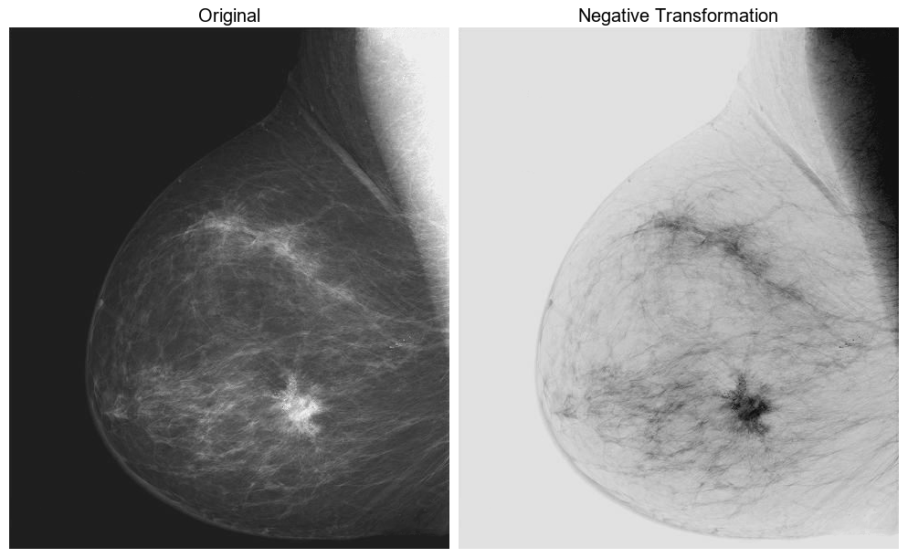  
영상의 어두운 영역에 놓여 있는 흰색이나 그레이 디테일을 개선시키는 데 특히 적합.  
그냥 반전한거지만 반전한 영상이 더 잘 보임.

##### 2. Log
`𝑠 = 𝑐𝑙𝑜𝑔(1 + 𝑟), 0 ≤ 𝑟`
  
어두운 화소의 값들은 시장시키고, 높은 레벨의 값들은 압축하고자 할 때 사용. **역 로그변환**은 그 반대.  
=> **Power Low** 가 더 유연.

로그 함수는 화소 값들의 편차가 큰 영상의 동적 범위를 압축하는 중요한 특성을 가짐. 고전적인 예 **Fourier 스펙트럼**  

※ **Fourier 스펙트럼**  
지금은 스펙트럼의 영상 특성에만 관심.  
**$0 \leq x \leq 10^6$** 이나 그 이상까지 변하는 스펙트럼 값들이 흔함.  
영상 표시 시스템들은 그렇게 넓은 범위의 밝기 값들을 표현할 수 없음.  
=> 디테일의 상당 부분이 손실.

``` python
# -------------------------- 역스케일링 -----------------------------
max_original_value = 1.5e6  # 최대 원본 값
scaling_factor = max_original_value / 255
# 역스케일링 적용
spectrum_array = original_array * scaling_factor
# --------------------------------------------------------------------

# -------------------------- 로그 변환 수행 --------------------------
c_log = 1  # c: 스케일링 상수 =>  표준 8비트 그레이스케일 범위 [0, 255] 벗어나지 않도록 , 이예제에는 C=1로 명시됨.  
log_array = c_log * np.log10(1 + spectrum_array)
# -------------------------------------------------------------------

# --------------------------- 스케일링 ----------------------------------
scaling_factor = 255 / np.max(log_array)
scaled_log_array = log_array * scaling_factor
scaled_log_array = scaled_log_array.astype(np.uint8)
# -------------------------------------------------------------------
```


  
**첫번째 그림** : **$0 \leq x \leq 1.5 \times 10^6$** 범위의 값을 갖는 Fourier 스펙트럼을 보여줌.  
8-비트 표시기를 위해 선형적으로 스케일링될 때, 스펙트럼의 가장 밝은 값의 화소들이 더 낮은 값들을 희생하여 표시기를 차지.  
=> 영상에서 흑색으로 나타나지 않은 상대적으로 작은 영역이 확인됨.  
  
**두번째 그림** : 로그변환을 통해 결과 값들의 범위를 **$0 \leq x \leq 6.2$**`로 변환됨.  
Fourier 스펙트럼 값에 로그변환을 적용한 후, 새 범위를 선형적으로 스케일링해서 똑같은 8비트 표시기에 스펙트럼을 표시한 결과.  
=> 풍부한 디테일을 확인할 수 있음.  
(근데 이미 original_image는 Fourier 스펙트럼을 8비트로 선형적으로 스케일링한 이미지임.  
원본 데이터의 정확한 동적 범위를 알 수 는 없지만 **$0 \leq x \leq 1.5 \times 10^6$** 범위로 역스케일링함.  이후 로그 변환을 적용.

※ 역스케일링하지 않고 바로 로그한건데 이 예제 결과랑 더 비슷한거 같음.. 뭐가 맞는거지?.. 
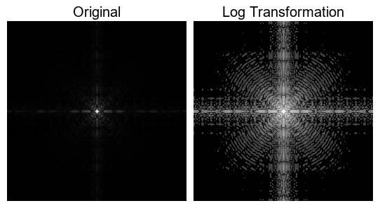

##### 3. Power Low
<p align="center">
  
</p>

`s = c𝑟^γ, 𝑟 ≥ 0`

※ 오프셋  
`s=c(𝑟+ε)^γ`
> c, 𝑟 ≥ 0  
> ε : offset

``` python
def gammaTransform(gamma, original_array):
 c_gamma = 255 / np.power(np.max(original_array), gamma)
 gamma_array = c_gamma * np.power(original_array, gamma)
 gamma_array = gamma_array.astype(np.uint8)
 return gamma_array
```

- **Gamma Correction**
   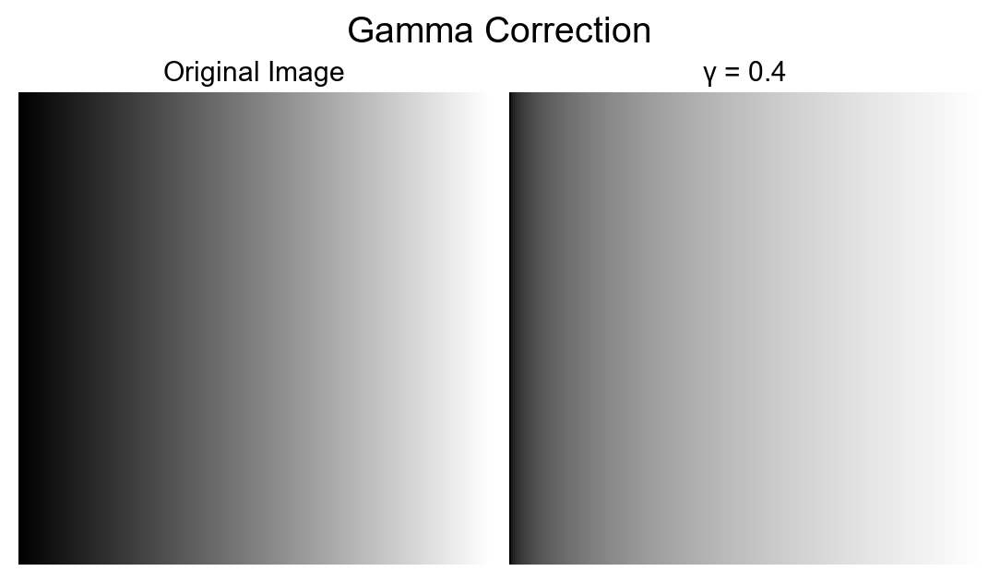
   
- **Constrast Enhancement**
   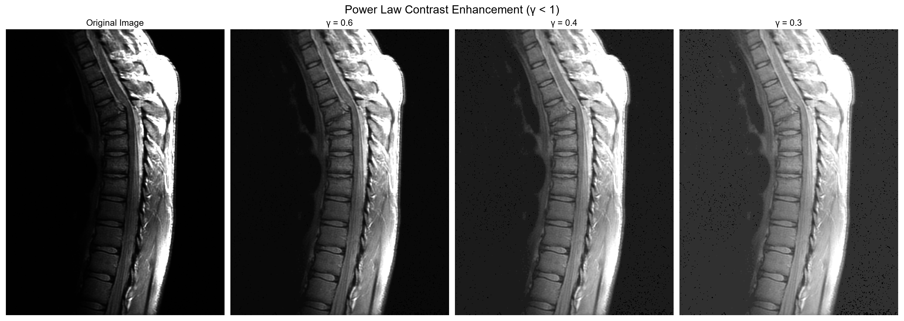
   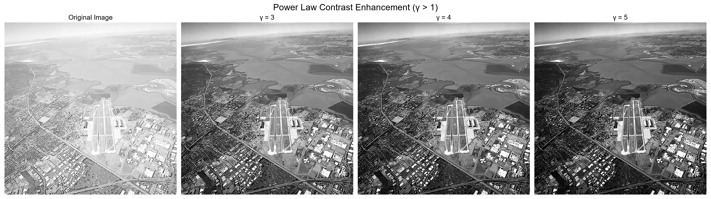
  
##### **※ Log VS PowerLow(γ < 1)**
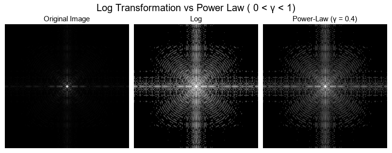  
Log 변환은 이미지의 밝기 범위를 균등하게 확장하여 이미지에서 밝기 값이 낮은 영역(어두운 부분)의 세부사항이 크게 강조.
로그 변환된 이미지는 패턴과 질감이 더욱 명확하게 드러남.
PowerLow(γ < 1)는  전체적으로 이미지를 부드럽게 하면서도 중요한 영역의 시각적인 구분을 명확하게 하는데 도움.
Log변환히 확실히 더 Fourier스펙트럼의 디테일을 잘 표현하는거 같음.  

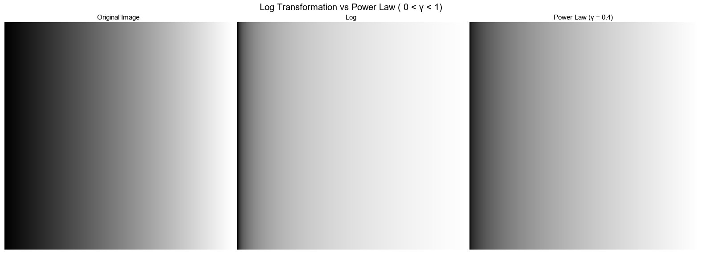
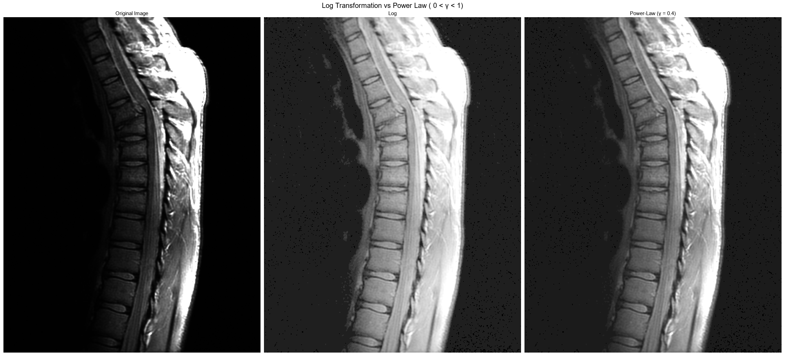
로그 변환은 특히 어두운 부분의 디테일을 더욱 선명하게 보이도록 해주는 반면, 밝은 부분은 디테일이 떨어짐.  
파워 로 변환은 어두운 부분의 디테일을 살려주면서 밝은 부분도 디테일이 살아있음. 전반적으로 대비를 더욱 증가시켜줍니다.

##### 4. Piecewise Linear
- **Contrast Stretching**
  
  `(r1, s1) = (r_min, 0), (r2, s2) = (r_max, L-1)`
  
<p align="center">
  
</p>

  ``` python
   def contrastStretching(original_array):
    min_val = np.min(original_array)
    max_val = np.max(original_array)
    # 0 ~ 255 스케일링
    # original_array - min_val :  픽셀 값에서 최소값을 뺌. 데이터의 최소값은 0이 됨.
    # / (max_val - min_val) : 데이터의 범위를 0에서 1사이로 정규화
    # * 255 : 0에서 255 사이의 값으로 확장
    stretched_array = (original_array - min_val) / (max_val - min_val) * 255 
    stretched_array = stretched_array.astype(np.uint8)
    return stretched_array
  ```
  `r1 = r2, s1 = 0, s2 = L - 1`
  <p align="center">
  
  </p>

  
  ``` python
  def thresholding(original_array):
   avg_val = np.average(original_array)
   # 평균값으로 이진화
   thresholded_array =np.where(original_array >= avg_val, 255, 0)
   thresholded_array = thresholded_array.astype(np.uint8)
   return thresholded_array
  ```
  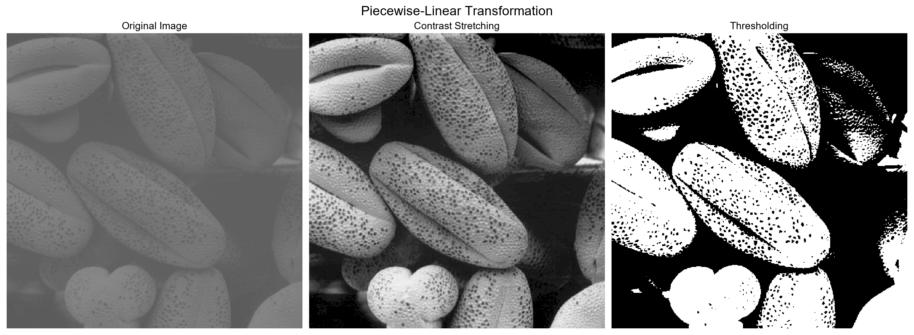

  
- **Inensity-Level-Slicing**
  
  특정 밝기 범위 강조
  <p align="center">
  
  </p>
  
  ``` python
   def intensityLevelSlicing(original_array, lower, upper, binary_mode):
    
    if binary_mode:
        sliced_array = np.where((original_array >= lower) & (original_array <= upper), 255, 0)
    else:
        sliced_array = np.where((original_array >= lower) & (original_array <= upper), 0, original_array)
        
    sliced_array = sliced_array.astype(np.uint8)
    return sliced_array
  ```
  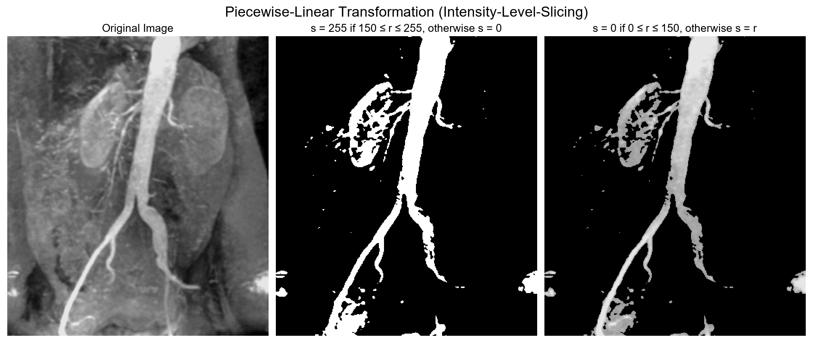 
  범위는 임의로 했음. 뒤로 가면 범위도 어떻게 정해야하는지 나오기 않을까...
  
- **Bit-plane slicing**
  
  특정 비트의 기여를 강조
  <p align="center">
  
  </p>
  
  ``` python
  def bitPlaneSlicing(original_array, i):
      mask = 1 << i
      sliced_array = (np.bitwise_and(original_array, mask) >> i)*255       
      sliced_array = sliced_array.astype(np.uint8)
      return sliced_array
  ```
  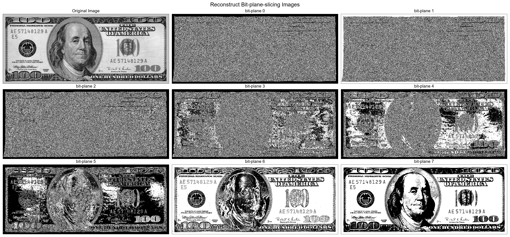

  ``` python
  def bitPlaneSlicing(original_array, i):
    mask = 1 << i
    sliced_array = (np.bitwise_and(original_array, mask) >> i)     
    sliced_array = sliced_array.astype(np.uint8)
    return sliced_array

  def reconstructing(original_array, Indexs):
      sliced_array = np.zeros_like(original_array)
      for num in Indexs:
          sliced_array += bitPlaneSlicing(original_array, num) * 2**num
      return sliced_array
  ```
  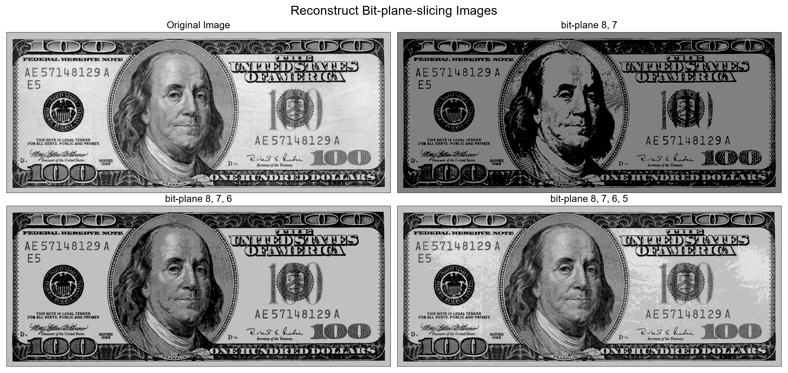
  영상 압축에 유용
  네 개의 최상위 비트 평면들을 저장하면 만족할 만한 디테일을 갖게 원래 영상을 복구할 수 있다.

#### 1.1.2 Histogram Processing

- 디지털 영상의 히스토그램 : **이산함수**
  
  $h(r_k) = n_k  where 0 ≤ r_k ≤ L-1$
  > $r_k$ : k번째 밝기 값
  > $n_k$ : 영상에서 밝기 $r_k$를 갖는 화소들 수

- 정규화
  
  $p(r_k) = n_k/NM$
  > N, M = 영상의 행과 열 수
  
- $p(r_k)$는 영상에서 밝기 레벨 $r_k$가 발생할 확률  
- 정규화된 히스토그램의 모든 요소의 합은 1
  
<p align="center">
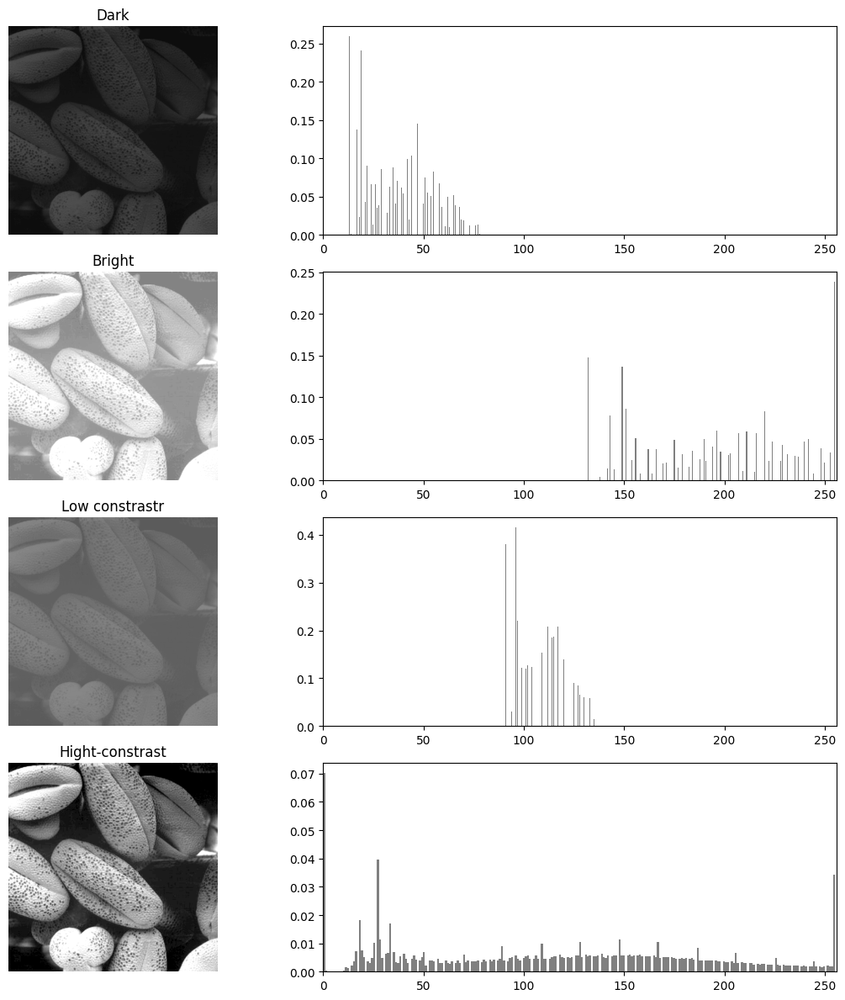
</p>

##### 1. Histogram equalization
- 연속적 밝기 값을 고려 (영상 밝기 값 $[0, L-1]$의 랜덤 변수)  
  **변환 조건**  
  
  <p align="center">
  
  </p>
  
  `s = 𝑇(𝑟), 0 ≤ 𝑟 ≤ L - 1`  
  > 1. 𝑇(𝑟)은 0 ≤ 𝑟 ≤ L - 1 구간의 **단조 증가함수**  
  > 2. 0 ≤ 𝑟 ≤ L - 1에 대해  0 ≤ s ≤ L - 1  

  `r = T(s)^(-1), 0 ≤ s ≤ L-1`  
  > 1. 𝑇(𝑟)은 0 ≤ 𝑟 ≤ L - 1 구간의 **엄밀 단조 증가함수**  
  > 2. 0 ≤ 𝑟 ≤ L - 1에 대해  0 ≤ s ≤ L - 1
  
  **$p_r(r)$, $p_s(s)$는 PDF(확률 밀도 함수)**  
  
  s = T(r)인 관계에서 $p_r(r)$과 $T(r)$이  알려져 있고, $T(r)$이 관심 값 범위에서 연속적이고 미분가능하다면 다음 공식 성립  
  
  **$p_s(s) = p_r(r) \left| \frac{dr}{ds} \right|$** 

  **히스토그램 평탄화 함수 정의**  
  
  **$s = T(r) = (L-1) \int_0^r p_r(w) \ dw$**  
  
  => $\int_0^r p_r(w) \ dw$은 𝑟의 **CDF**(누적 분포 함수)  
  => 조건 1, 2 모두 성립  
  
  $\frac{ds}{dr} = \frac{dT(r)}{dr} = (L-1) \frac{d}{dr} \left[\int_0^r p_r(w) \, dw\right] = (L-1) p_r(r)$  
  
  $p_s(s) = p_r(r) \left| \frac{dr}{ds} \right| = \frac{p_r(r)}{(L-1)p_r(r)} = \frac{1}{L-1} \quad \text{for} \quad 0 \leq s \leq L-1$

  $p_s(s)$의 형태는 **균등 확률 밀도 함수**.
  
  **이로 부터 $T(r)$은 $p_r(r)$에 종속되지만, 결과인 $p_s(s)$는  $p_r(r)$의 형태와 무관하게 항상 균등함을 알수 있음.**  
<p align="center">

</p>

- **이산 밝기 값**  
  $p_r(r_k) = \frac{n_k}{MN}$ ,  k = 0, 1, 2, ..., L-1  => $p_r(r_k)$ 대 $r_k$의 그래프를 **히스토그램**이라 부름
  
  
  
  $T(r_k)$를 **히스토그램 평활화** 또는 히스토그램 선형화 변환이라고 부름  
  조건 1,2 충족.
  
  > 
  > <p align="center">64x64 화소 3-비트 영상(L=8) 의 밝기 분포<br></p>
  >
  > 
  >
  > => 변환 함수는 계단 모양을 가짐.  
  > 변환후 최근접 정수로 Round
  >
  > 
  >
  > <p align="center"></p>
  
  연속적 짝과 달리 이산 히스토그램 평탄화가 균등한 히스토그램을 만든다는 것은 증명할수는 없지만,  
  충분히 입력 영상의 Histogram 분포를 **평탄화** 할 수 있다.  
  -> 평활화된 영상의 밝기 레벨들은 밝기 스케일에서 더 넓은 범위에 걸쳐있게 된다.  
  => **콘트라스트 개선 **
   
   파라미터 규정이 필요 없이 **자동**으로 변환이 가능  
  
  **역변환**의 경우 영상 히스토그램에 0인 성분이 없다면 조건 1,2를 충족.  


  


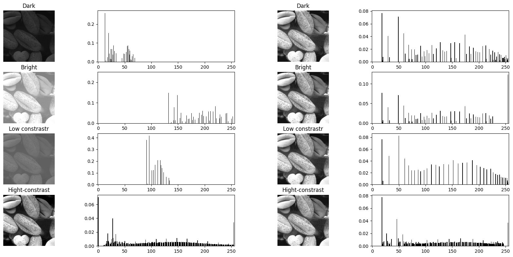

