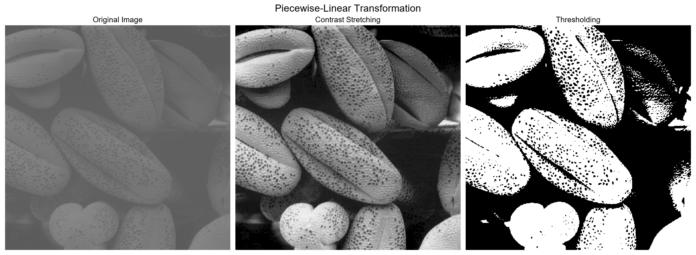

# Digital-Image-Processing
 Digital Image Processing Using python
 

## 1. Image Enhancement
### 1.1 Spatial Domain
- Point Operations (Intensity Transformations)
- Spatial Filters (or Mask, Kernel)
#### 1.1.1 Intensity Transformations
##### 1. Negative

##### 2. Log

##### 3. Power Low
1) Gamma Correction
   
2) Constrast Enhancement
   
   

##### ※ Log VS PowerLow

##### 4. Piecewise Linear
1) Contrast Stretching
   
2) Inensity-Level-Slicing
   
