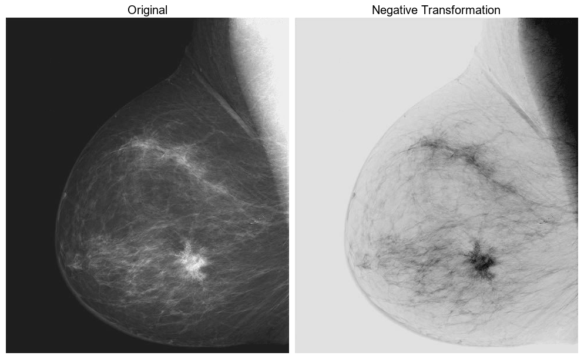
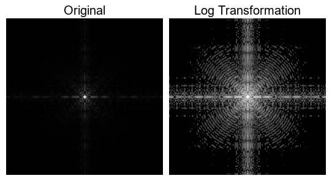
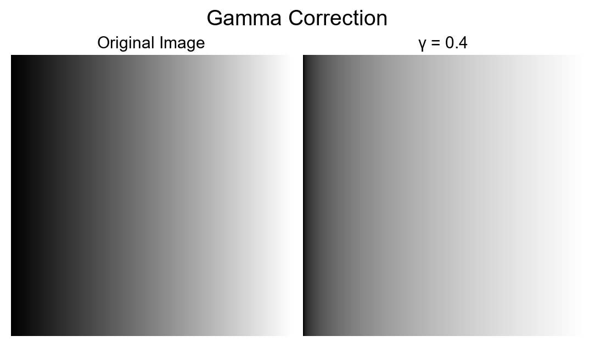
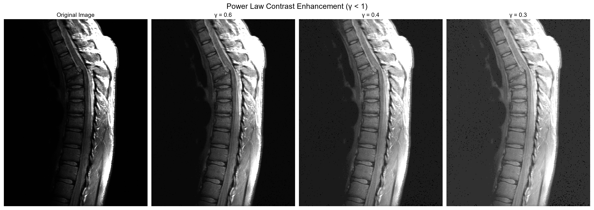
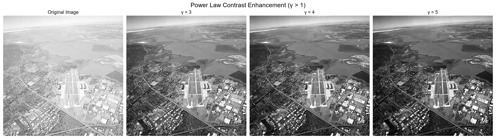
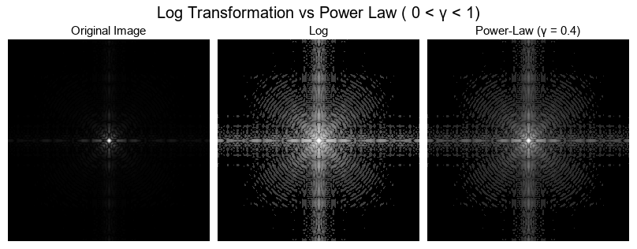
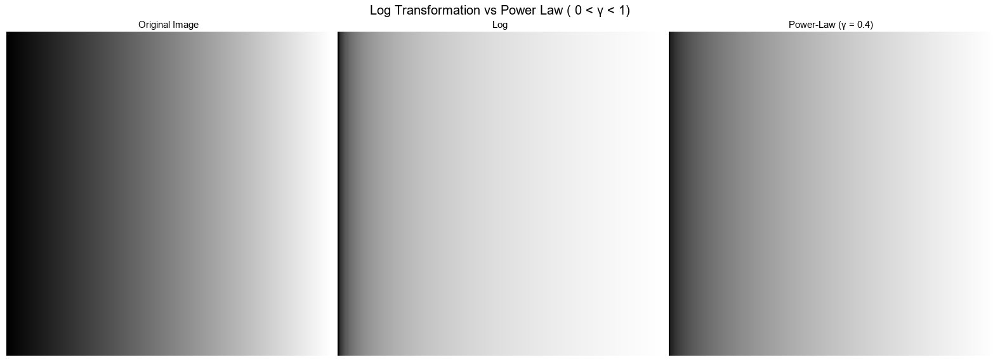
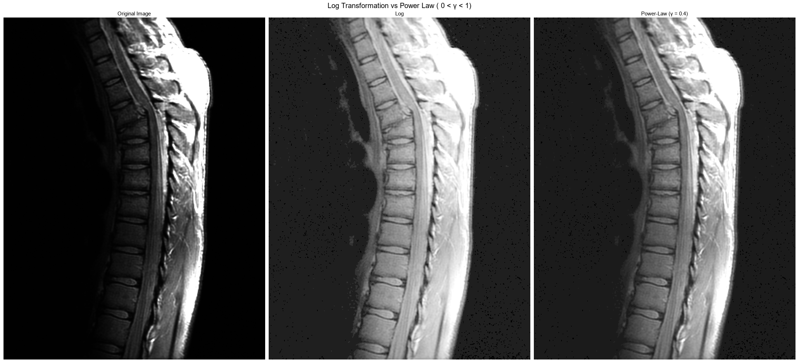
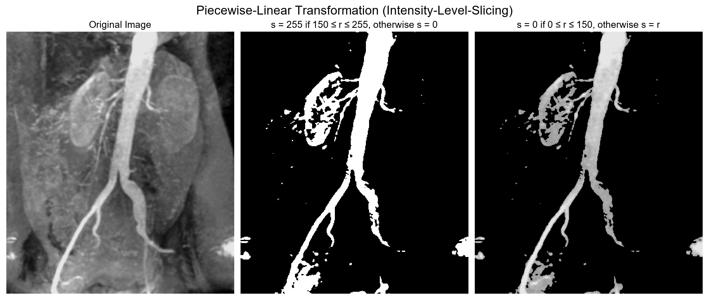

# Digital-Image-Processing
곤잘레스 Digital Image Processing 예제 Python으로  해보기  


> ※ 모듈 PIL, numpy 사용. matplotlib.pyplot 사용 안함.  
> 이미지 띄우면 크기 바껴서 나옴. 그럼 보간법 등으로 픽셀 달라지고,  plt.imshow(img)할때 cmap (컬러맵), vmin과 vmax 설정 필요.   
> - 그레이스케일 이미지에 'gray' 컬러맵 설정.
> - vmin과 vmax 설정 안하면 컨트라스트 스트레칭되서 띄어짐.  
## 1. Image Enhancement
### 1.1 Spatial Domain
- Point Operations (Intensity Transformations)
- Spatial Filters (or Mask, Kernel)
#### 1.1.1 Intensity Transformations
##### a. Negative
$s = L - 1 - r$
- r : 원본 이미지의 픽셀 값
- s : 변환된 이미지의 픽셀 값
- L : 최대 밝기 레벨의 수 (8비트 이미지 L = 256
  
``` python
max_value = np.iinfo(original_array.dtype).max
negative_array = max_value - original_array
```


##### b. Log

$s = c \cdot \log(1 + r) \quad \text{for} \quad r \geq 0$

``` python
original_image = Image.open(image_path)
original_array = np.array(original_image, dtype=np.float32)

c_log = 255 / np.log(1 + np.max(original_array))   # c: 스케일링 상수 =>  표준 8비트 그레이스케일 범위 [0, 255] 벗어나지 않도록 
log_array = c_log * np.log(1 + original_array) # np.log(1 + original_array)에서 256으로 오버플로우 발생하므로 dtype=np.float32로 설정.
```


##### c. Power Low

$s = c \cdot r^\gamma \quad \text{where } c \text{ and } \gamma \text{ are positive constants}$

※ 오프셋  
$s = c \cdot (r + o)^\gamma \quad \text{where } c, \gamma \text{ are positive constants, and } o \text{ is the offset}$

``` python
def gammaTransform(gamma, original_array):
 c_gamma = 255 / np.power(np.max(original_array), gamma)
 gamma_array = c_gamma * np.power(original_array, gamma)
 gamma_array = gamma_array.astype(np.uint8)
 return gamma_array
```

- **Gamma Correction**
   
   
- **Constrast Enhancement**
   
   
  
##### **※ Log VS PowerLow**




##### d. Piecewise Linear
- **Contrast Stretching**
  ``` python
   def contrastStretching(original_array):
    min_val = np.min(original_array)
    max_val = np.max(original_array)
    # 0 ~ 255 스케일링
    # original_array - min_val :  픽셀 값에서 최소값을 뺌. 데이터의 최소값은 0이 됨.
    # / (max_val - min_val) : 데이터의 범위를 0에서 1사이로 정규화
    # * 255 : 0에서 255 사이의 값으로 확장
    stretched_array = (original_array - min_val) / (max_val - min_val) * 255 
    stretched_array = stretched_array.astype(np.uint8)
    return stretched_array
  ``` 
  ``` python
  def thresholding(original_array):
   avg_val = np.average(original_array)
   # 평균값으로 이진화
   thresholded_array =np.where(original_array >= avg_val, 255, 0)
   thresholded_array = thresholded_array.astype(np.uint8)
   return thresholded_array
  ```
  

  
- **Inensity-Level-Slicing**
  ``` python
   def intensityLevelSlicing(original_array, lower, upper, binary_mode):
    
    if binary_mode:
        sliced_array = np.where((original_array >= lower) & (original_array <= upper), 255, 0)
    else:
        sliced_array = np.where((original_array >= lower) & (original_array <= upper), 0, original_array)
        
    sliced_array = sliced_array.astype(np.uint8)
    return sliced_array
  ```
   


